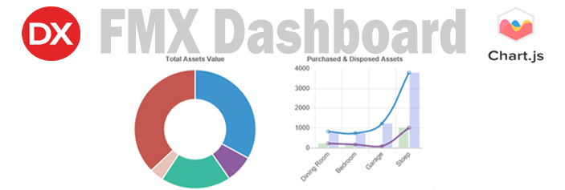
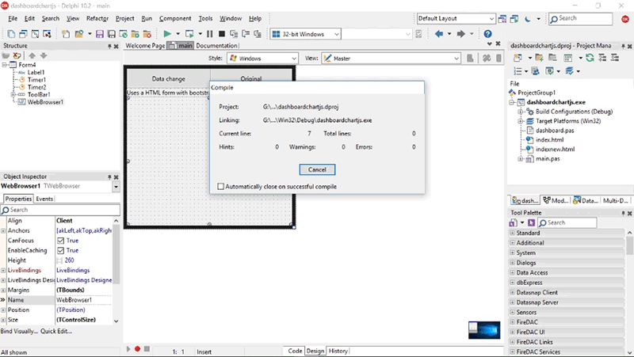

**Background**

This is an update to this blog and includes a source code update from Bootstrap
3 to Bootstrap 4. The older Bootstrap 3 code is still available for download.

When creating a clean Dashboard for your Application, as a developer your
requirements would require:

-   Be responsive.

-   Be professional with a clean look and feel.

-   Be gesture interactive.

**Chart.js library** provides all of this and can be incorporated into your
Delphi FMX or VCL App for quick results. The Chart.js JavaScript library is an
easy to use graph library which is responsive and gesture interactive in nature
making for a professional result.

Feel free to get the full story at my blog.

[Bayesean Blog – Delphi FMX Dashboard using
Chart.JS](https://bayeseanblog.com/blog/delphi-fmx-dashboard-using-chartjs/18).

**IDE**

Tokyo 10.2.3 is used, this should be backwards compatible to Berlin 10.1 version
as it makes use of the newer updated browser which includes using the newish
‘**EvaluateJavaScript ‘** method.

**Requirements**

Standard FMX Library used and or the VCL Library.

[ChartJS](http://www.chartjs.org/) Library.

[Bootstrap 4](https://getbootstrap.com/) Uses the container-fluid class (the
older code uses bootstrap 3).

Difficulty level: An understanding of HTML, CSS and JavaScript will help.

**Method**

The **TWebBrowser** component serves as the **Dashboard container** for the
Chart.JS library objects.

A HTML form (**index.html**) is added to the project. The **onshow** event loads
the **html file** into the browser. The Html file uses standard html code to
call the external CSS and JavaScript files directly without any further
developer intervention also contains the html chart id’s to where the JavaScript
will position the charts with the HTML…

Please note that the code includes bootstrap3 version and bootstrap 4 version.

**Licence MIT**

Happy Coding
